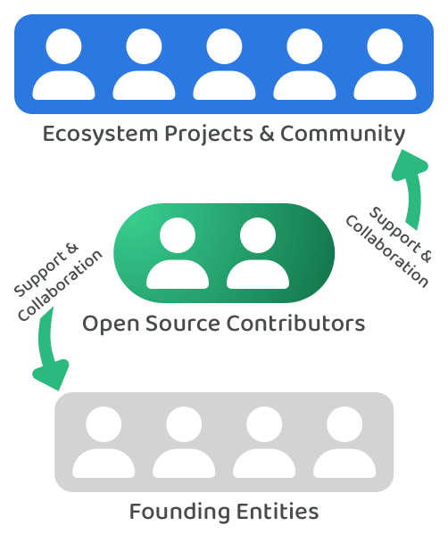

# Opportunities

A contributor funding experiment can help with generating insightful data sets that help with learning about the long term opportunity of adopting a contributor funding process. The following are some of the example opportunities that this experiment could help with.

**Increased return on investment**

Contributor funding will often be much simpler and quicker than idea funding as it reduces the complexity and time required for voters and contributors to participate in the funding process. The data generated from this experiment can help with providing evidence about the potential return on investment that is possible with contributor funding. This data can then be compared with other funding processes. Even with this initial experiment the simplicity and speed of contributor funding could result in a higher return on investment than many existing idea based funding processes.

**Collaborative & supportive structure**

<figure><figcaption></figcaption></figure>

Open source contributors can help with creating a collaborative and supportive structure that sits on top of the founding entities. Contributors will help with the development of various open source libraries that are beneficial to the ecosystem but they can also collaborate with the founding entities, community and existing projects over different issues and opportunities. The ecosystem can benefit from contributors that are able to work across many ideas and respond to what is happening in the ecosystem as they can then align themselves with contribution efforts that could generate the most impact. This could mean creating new libraries or adding features to existing ones based on feedback from founding entities or existing community projects. Even a small cohort of open source contributors will be useful for learning about how a collaborative and supportive structure could be beneficial to the ecosystem.

**Verifiable contributions outputs**

This suggested funding experiment will adopt a simple monthly individual contribution log process to record and verify each person's contributions. If this approach proves effective the longer term opportunity will be around how existing tools and infrastructure can be integrated into the funding process to automatically handle the recording and verification of contribution efforts. Over the long term most digital contributions could be automatically recorded and added to someone's contribution logs that are attached to their identity profile.

**Identity & reputation tools**

A [number of potential identity use cases for contributors](https://docs.contributors.org/identity/contributor-identity-use-cases) have been documented separately. This initial suggested experiment does not need the integration of identity solutions to produce insightful data. Some identity use cases that could be integrated in a subsequent funding experiment could include:

* **Contributor selection credential** - Contributors that are selected to receive funding could receive a credential that enables others to verify that they have in fact been selected and funded by the ecosystems treasury.
* **Contributor profiles** - Contributors should be able to make a simple professional profile that they can repeatedly use to apply as a contributor candidate. This profile will ideally capture their personal and professional background information and their contribution history.
* **Contribution logs** - Contributors could attach their contribution logs to a new identity profile which can then be used more easily across any ecosystem to prove their contribution history. Verifiable contribution logs could be an effective way for someone to build up their reputation across many ecosystems.
