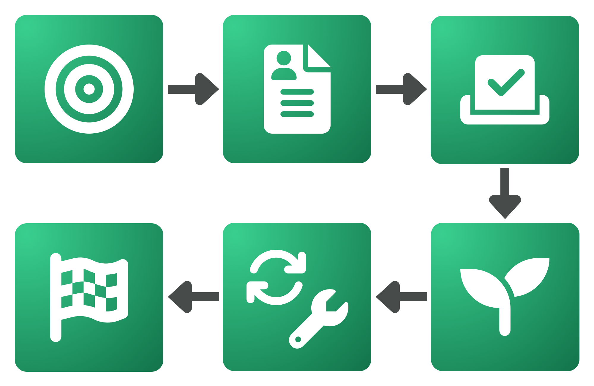

# Overview

An open source contributor funding experiment is looking to explore how contributors could be funded to help with developing the most impactful open source solutions in a Web3 ecosystem. This experiment was created due to the [open source contributor funding](https://app.gitbook.com/s/Zzfl1XcpAphbCFDyUysC/proposal/open-source-contributors) proposal.

**Why run this experiment?**

The goal and objectives around this experiment are focused on learning as much as possible about contributor funding and the effectiveness of a number of approaches that have been suggested from our [funding process analysis](https://app.gitbook.com/o/jOQu4b6VLDxaQsg2rVwG/s/8L61e8ulVlk90t5mlQk1/). If successful this experiment could generate a large amount of impact and become a long term solution for a Web3 ecosystem. The experiment is inexpensive to set up and operate and has been designed to generate a range of insightful data points. This data can then be used to improve future iterations of the experiment and for comparing this funding process with other funding processes across the industry.

**Who’s involved in this experiment?**

* **Contributors** - Developers from the community will submit contributor proposals to be considered as a candidate. Candidates that get selected will be funded to work on open source initiatives that are most likely to generate impact for the ecosystem.
* **Voters** - Voters will be responsible for selecting the most promising contributor candidates to work on open source initiatives. The voters could be the founding entities or the community.
* **Community members** - Anyone in the community will be invited to provide feedback and interact with the contributors and the funding operator throughout the experiment.
* **Founding entities** - The founding entities will often be responsible for approving this experiment and allocating the funding to this initiative. They will be invited to provide feedback throughout the process and might also be responsible for handling contributor payments.
* **Funding operator** - The funding operator is responsible for managing the funding process experiment and keeping everyone well informed on what is happening, what the next steps are and with answering any questions or concerns that anyone has.

**What is the experiment process?**

<figure><figcaption></figcaption></figure>

1. **Priority suggestions - C**ommunity members will be asked to share their suggestions about what open source initiatives they believe would be the most impactful for contributors to focus on. Community members can upvote and comment on any existing suggestions.
2. **Contributor proposal submissions -** Community members are invited to submit contributor proposals with their personal and professional information. The community is then invited to give feedback before these proposals are finalised. Contributors are also then asked to give some feedback about the proposal submission process.
3. **Voting process** - Voters select the contributor candidates that they believe will generate the most impact for the ecosystem. Voting data and results will be released to the public and then voters will be asked to give their feedback about the voting process.
4. **Contributor onboarding** - The successfully selected contributors are onboarded into the funding process and invited to join any of the chat channels that have been created for communication. The initial tasks that contributors work on will be decided and added to a contribution task board.
5. **Monthly contribution period** - Contributors begin their monthly contributions and will keep a record of their contribution outcomes in a contribution log. At the end of the month the contribution logs of each contributor are checked and verified so that they can continue to receive future payments. Contributors will continuously update their contribution tasks with any progress that has been made. Community members are invited to give feedback to the contributors about any of the tasks that are being executed.
6. **Funding process completion** - Once the funding round is completed the contributors and the community will be asked to peer review and give any feedback they have to other contributors. Voters and contributors will then be asked to give their feedback and opinions about the funding process.

**How long will it take to complete?**

The experiment can run for as long as an ecosystem wants it to, however we currently recommend either 4 or 6 months as a suitable duration. This duration helps to better ensure there is enough time for contributors to make impactful contributions whilst also being cautious about the amount of funding that is being committed to the experiment. This shorter experiment duration is also useful for making more iterative changes and improvements to the experiment for any future funding rounds.

**How much will the experiment cost?**

The funding operator costs would come to around $5,000 to $10,000 depending on the scale and duration of the experiment. The majority of the experiment costs are dependent on how many contributors an ecosystem would like to trial the experiment with and what the maximum amount is that contributors could be paid each month. This determines the maximum potential cost of the experiment. The actual cost could be lower as the selected contributors might not request the maximum amount in their proposal. The final contributor costs will be based on the cost per month of the contributors that get selected multiplied by the duration of the experiment. Some example maximum experiment costings are as follows:

* **Example 1:** 6 month duration x 3 contributors x $10,000 max per month allocation + \~$10,000 funding operator = $190,000 maximum cost
* **Example 2:** 4 month duration x 2 contributors x $10,000 max per month allocation + \~$7,500 funding operator = $87,500 maximum cost
* **Example 3:** 4 month duration x 1 contributor x $8,000 max per month allocation + \~$5,000 funding operator = $37,000 maximum cost

**How will it be determined whether the experiment was successful?**

All contributions made by contributors during this experiment will be open source. Any feedback and data collected during the funding experiment will also be open source. The funding operator will make the experiments data available and easily accessible from a GitBook resource. A report will also be included that highlights any key insights, problems, opportunities and trends that were identified from analysing the experiment data. The data and any findings can also then be compared with other funding processes across the industry.
